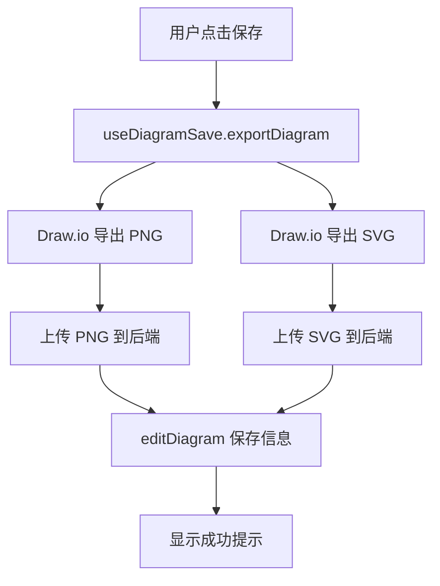
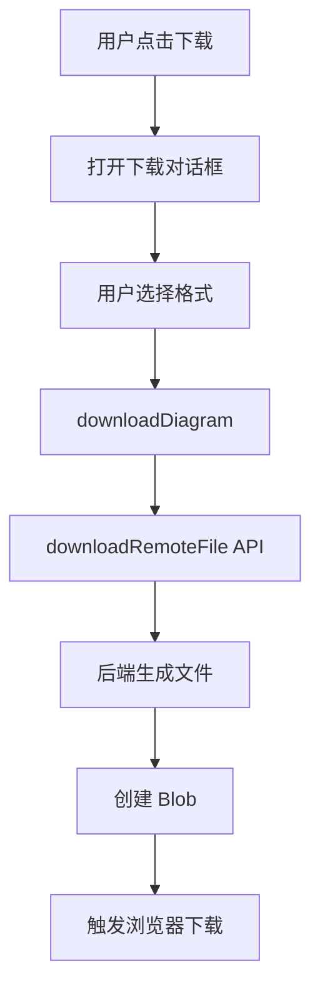

# 图表保存和下载功能实现指南

## 📋 功能概述

本次更新为图表编辑页面添加了完整的**保存**和**下载**功能，实现了前后端完整的文件管理流程。

## ✅ 已实现的功能

### 1. **保存图表功能**

当用户点击**保存**按钮时：

1. **前端生成 PNG 和 SVG 文件**
   - 使用 Draw.io 的 `exportDiagram` API 导出 PNG
   - 使用 Draw.io 的 `exportDiagram` API 导出 SVG

2. **上传文件到后端**
   - 调用 `uploadDiagram` API 上传 PNG 文件
   - 调用 `uploadDiagram` API 上传 SVG 文件
   - 并行上传以提高效率

3. **保存图表信息**
   - 调用 `editDiagram` API 保存图表元数据
   - 包含：标题、XML 代码、图片 URL

### 2. **下载图表功能**

当用户点击**下载**按钮时：

1. **选择下载格式**
   - XML (.drawio) - Draw.io 可编辑格式
   - PNG - 高清位图
   - SVG - 矢量图

2. **调用后端下载接口**
   - 调用 `downloadRemoteFile` API
   - 后端根据类型生成对应格式文件

3. **触发浏览器下载**
   - 创建 Blob 对象
   - 生成临时下载链接
   - 自动触发下载

## 🏗️ 架构设计

### **核心组件**

```
components/
├── diagram-toolbar.tsx        # 工具栏组件（保存/下载按钮）
├── download-dialog.tsx        # 下载对话框（选择格式）
└── save-dialog.tsx            # 保存对话框（已存在，复用）

lib/
└── use-diagram-save.ts        # 保存和下载的 Hook
```

### **数据流程**

#### 保存流程



#### 下载流程



## 🔧 API 对接

### **使用的后端 API**

| API | 方法 | 功能 |
|-----|------|------|
| `/diagram/upload` | POST | 上传 PNG/SVG 文件 |
| `/diagram/edit` | POST | 保存图表信息 |
| `/diagram/stream-download` | GET | 下载图表文件 |

### **API 请求示例**

#### 1. 上传文件

```typescript
const response = await uploadDiagram({
  body: {
    diagramUploadRequest: {
      biz: "png", // 或 "svg"
      diagramId: 123,
      fileBase64: "data:image/png;base64,iVBORw0KGg..."
    }
  }
})
// 返回: { code: 0, data: "https://minio.example.com/file.png" }
```

#### 2. 保存图表信息

```typescript
const response = await editDiagram({
  body: {
    id: 123,
    title: "流程图",
    diagramCode: "<mxfile>...</mxfile>",
    pictureUrl: "https://minio.example.com/file.png"
  }
})
// 返回: { code: 0, data: true }
```

#### 3. 下载文件

```typescript
const response = await downloadRemoteFile({
  params: {
    diagramId: 123,
    type: "png", // 或 "svg", "xml"
    fileName: "流程图"
  },
  responseType: "blob"
})
// 返回: Blob 数据
```

## 📦 复用的 shadcn/ui 组件

所有对话框都完全复用了 `components/ui` 的组件：

```tsx
import { Button } from "@/components/ui/button"
import { Dialog, DialogContent, DialogFooter, DialogHeader, DialogTitle } from "@/components/ui/dialog"
import { Select, SelectContent, SelectItem, SelectTrigger, SelectValue } from "@/components/ui/select"
```

### **组件结构**

**DownloadDialog** (新组件)
```tsx
<Dialog>
  <DialogContent>
    <DialogHeader>下载图表</DialogHeader>
    <Select>格式选择</Select>
    <DialogFooter>
      <Button>取消</Button>
      <Button>下载</Button>
    </DialogFooter>
  </DialogContent>
</Dialog>
```

**SaveDialog** (已存在，完全复用)
```tsx
<Dialog>
  <DialogContent>
    <DialogHeader>保存图表</DialogHeader>
    <Select>格式选择</Select>
    <Input>文件名输入</Input>
    <DialogFooter>
      <Button>取消</Button>
      <Button>保存</Button>
    </DialogFooter>
  </DialogContent>
</Dialog>
```

## 🎯 使用方法

### **用户操作流程**

#### 保存图表

1. 编辑图表完成后，点击右上角的 **💾 保存** 按钮
2. 系统自动：
   - 导出 PNG 和 SVG
   - 上传到后端
   - 保存图表信息
3. 显示 "保存成功" 提示

#### 下载图表

1. 点击右上角的 **⬇️ 下载** 按钮
2. 在对话框中选择下载格式：
   - **Draw.io XML** - 可编辑的源文件
   - **PNG 图片** - 适合演示和分享
   - **SVG 矢量图** - 可无损缩放
3. 点击 **下载** 按钮
4. 浏览器自动下载文件

## 🎨 UI 展示

### 工具栏位置

```
┌─────────────────────────────────────────────┐
│  [Draw.io 编辑区]              [💾保存] [⬇️下载] [🔳全屏]  │
│                                              │
│                                              │
└─────────────────────────────────────────────┘
```

### 下载对话框

```
┌──────────────────────┐
│  下载图表         ×  │
├──────────────────────┤
│ 文件名:              │
│ [图表_123        ]   │
│                      │
│ 下载格式:            │
│ [Draw.io XML     ▼]  │
│                      │
│ ℹ️ 下载 Draw.io 可    │
│    编辑的 XML 文件    │
│                      │
│       [取消] [下载]   │
└──────────────────────┘
```

## 🔑 关键特性

### ✅ 完全复用 shadcn/ui

- ✅ **Dialog** - 对话框容器
- ✅ **Button** - 所有按钮
- ✅ **Select** - 格式选择
- ✅ **Input** - 文件名输入
- ✅ **Label** - 表单标签

### ✅ 用户体验优化

- ✅ **Toast 提示** - 保存/下载状态反馈
- ✅ **加载状态** - 按钮显示"保存中..."/"下载中..."
- ✅ **自动文件名** - 默认使用图表标题
- ✅ **格式说明** - 每种格式都有提示文字

### ✅ 错误处理

- ✅ **网络错误捕获**
- ✅ **友好的错误提示**
- ✅ **操作失败回滚**

## 🚀 技术亮点

1. **Promise 封装** - Draw.io 导出功能封装为 Promise，方便使用
2. **并行上传** - PNG 和 SVG 并行上传，提高效率
3. **Base64 转换** - 自动将 File 转换为 Base64 上传
4. **Blob 下载** - 后端返回 Blob，自动触发浏览器下载
5. **类型安全** - 完整的 TypeScript 类型定义

## 📝 代码示例

### 使用 useDiagramSave Hook

```typescript
import { useDiagramSave } from "@/lib/use-diagram-save"

const { saveDiagram, downloadDiagram } = useDiagramSave(drawioRef)

// 保存
await saveDiagram({
  diagramId: 123,
  title: "流程图",
  xml: "<mxfile>...</mxfile>"
})

// 下载
await downloadDiagram({
  diagramId: 123,
  filename: "流程图",
  format: "png"
})
```

### 导出图表

```typescript
const { exportDiagram } = useDiagramSave(drawioRef)

// 导出为 PNG
const pngData = await exportDiagram("png")
const pngFile = base64ToFile(pngData, "chart.png", "image/png")

// 导出为 SVG
const svgData = await exportDiagram("svg")
const svgFile = base64ToFile(svgData, "chart.svg", "image/svg+xml")
```

## 🎉 总结

本次实现：

✅ 完全复用 shadcn/ui 组件
✅ 完整的保存流程（导出 → 上传 → 保存）
✅ 灵活的下载功能（三种格式可选）
✅ 良好的用户体验（加载提示、错误处理）
✅ 类型安全的 TypeScript 实现
✅ 清晰的代码结构（易于维护）

所有 UI 组件都来自 `components/ui`，完全符合你的复用要求！🎨
